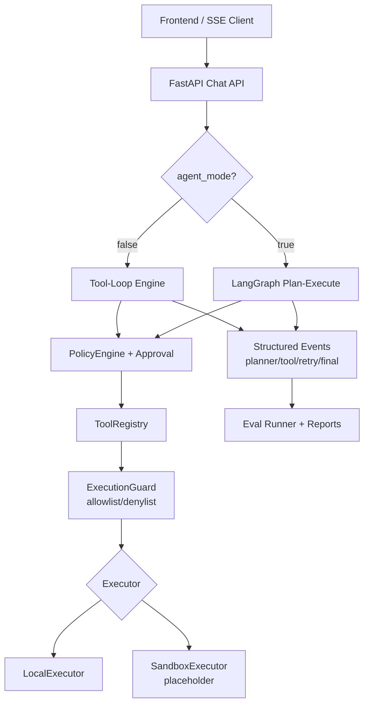

# Agent Chat Platform (Interview-Oriented)

> 一个**面试导向**的个人 Agent 工程项目：重点展示 workflow / memory / eval / safety / observability 的系统化工程能力，而不是生产级平台宣称。


## 项目定位

这个项目已经具备：状态机式执行、ReAct/Plan-and-Execute、MCP、多工具编排、结构化输出、搜索校验、幻觉检测与重试。

本次迭代聚焦高 ROI 升级：
- **Eval & Reliability**：可回归 case、统一 runner、baseline 对比
- **Minimal Sandbox Story**：执行器抽象 + 风险分级 + allow/deny + approval hook（扩展点）
- **Observability**：结构化 trace 信号（planner / tool / retry / final）
- **README & Demo**：可讲清“做了什么、没做什么、为何这样做”

## 明确支持 / 不支持

### ✅ 当前支持
- Tool-loop 与 LangGraph agent_mode 双路径
- 多工具调用、参数校验、超时与重试
- 风险分级策略（read/write/destructive/admin）与 approval 流程
- YAML 驱动 eval + live/smoke runner + 报告与 baseline compare
- 结构化事件流（SSE）与 trace artifact

### ⚠️ 当前不支持（有意保留为扩展点）
- 真正隔离的容器/VM 沙箱（仅保留 `SandboxExecutor` placeholder）
- 生产级多租户权限体系 / 审计合规
- 大规模 benchmark 与线上 SLA 承诺

## 架构（面试讲解版）



## Eval & Reliability

新增 `backend/eval/cases/interview_reliability.yaml`，覆盖 14 个回归 case：
- 正常工具调用
- 参数错误 / unknown tool
- 搜索失败与无证据回答约束
- 重试信号 / 超时 / tool failure
- 熔断（max tool calls）
- policy denied / approval required
- final answer trace 信号

统一入口：

```bash
cd backend
make eval-regression
```

真实链路回归：

```bash
cd backend
AC_EVAL_TOKEN=your-shared-token make eval-regression-live
```

支持 baseline 对比：

```bash
uv run --extra dev python -m eval.regression_runner \
  --mode smoke \
  --baseline eval/artifacts-baseline/report.json
```

输出包括：
- pass/fail
- 耗时
- fail reason
- `key_trace_signals`（核心阶段信号）

## Minimal Sandbox / Approval Story

核心设计：
- `Executor` 接口 + `LocalExecutor` / `SandboxExecutor`
- `ExecutionGuard`：command allowlist / denylist
- 风险等级触发 approval hook（默认 write+ 需审批）

> 说明：当前 `SandboxExecutor` 仅为 placeholder，用于面试演示“抽象边界与扩展路径”，并未提供真实隔离能力。

相关配置（环境变量前缀 `AC_`）：
- `EXECUTOR_MODE=local|sandbox`
- `COMMAND_ALLOWLIST`（逗号分隔）
- `COMMAND_DENYLIST`（逗号分隔）

## Observability（可演示失败链路）

新增关键事件：
- `planner.start`
- `planner.done`
- `tool.retry`
- `run.finish`

示例失败 trace（节选）：

```json
{"type":"planner.start","data":{"run_id":"..."}}
{"type":"tool.call","data":{"name":"web_fetch","step_index":0}}
{"type":"tool.result","data":{"name":"web_fetch","code":"TIMEOUT"}}
{"type":"tool.retry","data":{"name":"web_fetch","attempts":2}}
{"type":"run.finish","data":{"finish_reason":"stop"}}
```

## Demo 场景（建议面试演示）

1. **多步检索 + 综合回答**
   - 用户问题 → search tool → 最终答案
   - 演示点：工具编排 + trace 可见性

2. **高风险命令被拒绝**
   - 输入触发 destructive command
   - 演示点：risk level + denylist + approval story

3. **工具超时后的重试与降级**
   - 演示 TIMEOUT → retry → graceful answer
   - 演示点：reliability 与失败可恢复路径

### Bad Cases + 修复思路

- **Bad case 1：无证据直接下结论（幻觉）**
  - 现象：未调用搜索工具仍输出确定性事实
  - 修复：case 增加 `must_call_tools` + `must_not_contain`，并在提示词里强化“无证据先检索”

- **Bad case 2：高风险 command 未被约束**
  - 现象：command 工具直接执行危险命令
  - 修复：`ExecutionGuard` denylist + risk-based approval，后续接真实 sandbox

## 快速启动

```bash
docker compose up --build
```

后端常用命令：

```bash
cd backend
make test
make eval-smoke
make eval-compare BASELINE=eval/artifacts-smoke/report.json CURRENT=eval/artifacts-interview/report.json
```

---

如果你在面试中使用本项目，建议明确表述：
- 这是一个**工程化能力展示项目**（而非生产平台）
- 我关注的是：可回归、可观测、可扩展、可讲清楚的 Agent 核心机制
