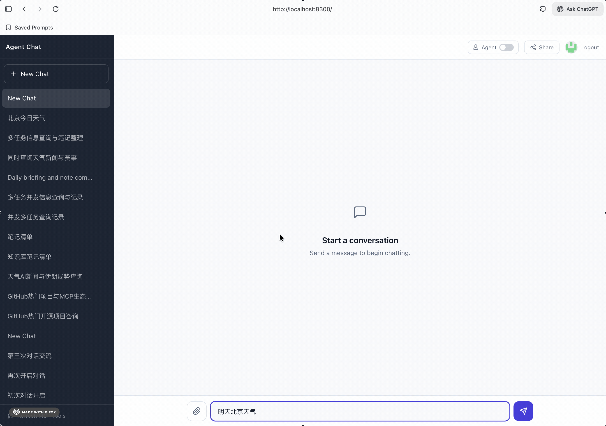

# Agent Chat Platform

全栈 **AI Agent 对话平台**——支持 LangGraph 多步规划执行、并发工具调用、MCP 集成、PDF 知识库（RAG）、长期记忆、多会话并行流式传输与对话分享回放，体验对标 ChatGPT / Claude，可完全自托管与自由扩展。




---

## 功能清单

| 分类 | 功能 | 说明 |
|------|------|------|
| **Agent** | Plan-Execute-Synthesize | 基于 LangGraph 的规划→执行→综合三阶段 Agent 流水线 |
| **Agent** | 并发工具执行 | 同一 `parallel_group` 内的工具并发执行，跨 group 按依赖顺序串行 |
| **Agent** | 依赖参数解析 | group 1+ 的工具参数由 LLM 根据前序工具结果自动填充 |
| **Agent** | 双模式切换 | 一键切换 Agent 模式（LangGraph）与普通对话模式（工具循环） |
| **对话** | SSE 流式输出 | 基于 Server-Sent Events 逐 token 实时推送 |
| **对话** | 多会话并行 | 每个对话独立缓存消息和流式状态，切换不中断流 |
| **对话** | 轮询恢复 | SSE 断连后自动轮询恢复，支持页面刷新后重连进行中的任务 |
| **工具** | 联网搜索 | SerpAPI（主）+ Brave Search（备） |
| **工具** | 新闻 | NewsAPI 热点新闻查询 |
| **工具** | 天气 | Open-Meteo 实时天气与 7 天预报 |
| **工具** | 网页抓取 | `web_fetch` 抓取 URL 正文；`ingest_webpage` 抓取并入库 |
| **RAG** | PDF 知识库 | 上传 PDF → 分块 → 嵌入 (all-MiniLM-L6-v2) → 向量检索 |
| **RAG** | 知识库搜索工具 | LLM 在对话中可主动查询向量知识库 |
| **MCP** | MCP 适配器 | 动态发现并注册任意 MCP 服务器上的工具，自动映射风险等级 |
| **MCP** | 笔记服务 | 通过 MCP 集成 Obsidian 笔记，支持查询、创建、编辑、删除 |
| **记忆** | 长期记忆 | 自动嵌入用户消息 → 跨对话语义检索 |
| **记忆** | 记忆压缩 | 后台由 LLM 将历史记忆压缩为摘要 |
| **分享** | 对话分享 | 生成公开分享链接，无需登录即可查看 |
| **分享** | Trace 回放 | 可视化回放完整执行过程：规划、工具调用、耗时、LLM 响应 |
| **认证** | GitHub OAuth + JWT | 基于 GitHub 登录与 JWT 令牌的安全认证 |
| **评估** | 自动化评估 | YAML 用例 + Rule Scorer（must_contain / must_call_tools / max_time_ms 等） + Live SSE Runner + HTML 报告 |

---

## 架构图

```
┌──────────────────────────────────────────────────────────────┐
│                     Frontend (:8300)                         │
│            React 19 · TypeScript · Tailwind CSS v4           │
│                                                              │
│  ┌────────────────┐  ┌───────────────┐  ┌────────────────┐  │
│  │  Multi-Conv     │  │  Polling      │  │  Trace View    │  │
│  │  Cache + SSE    │  │  Recovery     │  │  (可视化回放)  │  │
│  └────────────────┘  └───────────────┘  └────────────────┘  │
└────────────────────────┬─────────────────────────────────────┘
                         │  SSE / REST / Poll
                         ▼
┌──────────────────────────────────────────────────────────────┐
│                     Backend (:8301)                          │
│              FastAPI · Python 3.14 · Uvicorn                 │
│                                                              │
│  ┌─────────────────────────────────────────────────────────┐ │
│  │              Chat Service Router                        │ │
│  │     agent_mode=true  →  LangGraph Agent Service         │ │
│  │     agent_mode=false →  Tool-Loop Chat Service          │ │
│  └──────────┬──────────────────────────────────────────────┘ │
│             │                                                │
│  ┌──────────▼──────────────────────────────────────────────┐ │
│  │         LangGraph Plan-Execute-Synthesize               │ │
│  │                                                          │ │
│  │  Planner ──→ Executor ──→ Synthesizer                   │ │
│  │  (LLM规划)   (并发执行,    (流式综合                     │ │
│  │              依赖解析)      回答)                        │ │
│  └──────────┬──────────────────────────────────────────────┘ │
│             │                                                │
│  ┌──────────▼──────────────────────────────────────────────┐ │
│  │              Tool Registry (工具注册表)                  │ │
│  │  search · news · weather · web_fetch · read_pdf         │ │
│  │  kb_search · search_memory · ingest_webpage             │ │
│  │  MCP tools: query_notes · edit_notes · delete_note      │ │
│  └─────────────────────────────────────────────────────────┘ │
│                                                              │
│  ┌──────────────┐  ┌──────────────┐  ┌──────────────┐       │
│  │ Memory Svc   │  │ KB / PDF Svc │  │ Embedding    │       │
│  │ (嵌入, 压缩) │  │ (分块, RAG)  │  │  Service     │       │
│  └──────────────┘  └──────────────┘  └──────────────┘       │
└──────┬───────────────┬──────────────────┬────────────────────┘
       │               │                  │
       ▼               ▼                  ▼
┌────────────┐  ┌─────────────┐   ┌──────────────────┐
│  LLM APIs  │  │  MongoDB    │   │  MCP Servers     │
│  Kimi /    │  │  文档+向量   │   │  (Notes, etc.)   │
│  Poe / ... │  │  + 检查点   │   │                  │
└────────────┘  └─────────────┘   └──────────────────┘
```

---

## Agent 模式工作流

```
用户消息
   │
   ▼
┌─────────────────────────────────────┐
│  Planner (LLM)                      │
│  分析问题 → 输出 JSON 执行计划       │
│  每个工具标注 parallel_group         │
└──────────────┬──────────────────────┘
               │
   ┌───────────▼───────────┐
   │  Executor             │
   │                       │
   │  Group 0: 并发执行     │──→ weather + news + search  (同时)
   │           ↓            │
   │  Group 1: 依赖解析     │──→ LLM 根据 Group 0 结果填充参数
   │           并发执行     │──→ web_fetch (读取搜索结果页面)
   │           ↓            │
   │  Group 2: 依赖解析     │──→ edit_notes (写入整理后的内容)
   │           执行         │
   └───────────┬───────────┘
               │
   ┌───────────▼───────────┐
   │  Synthesizer (LLM)    │
   │  基于所有工具结果       │
   │  流式生成最终回答       │
   └───────────────────────┘
```

---

## 快速开始

### Docker Compose 一键启动（推荐）

```bash
# 1. 克隆并配置
git clone https://github.com/RichLogic/agent-chat-platform.git
cd agent-chat-platform
cp .env.example .env        # ← 填入你的 API Key

# 2. 启动所有服务
docker compose up --build

# 3. 打开浏览器
#    前端 → http://localhost:8300
#    后端 → http://localhost:8301/docs  (Swagger 文档)
```

### 本地开发

```bash
# MongoDB
docker run -d -p 27017:27017 mongodb/mongodb-atlas-local:8.0

# 后端
cd backend
uv sync --dev
uv run uvicorn agent_chat.main:app --reload --port 8301

# 前端（另开终端）
cd frontend
npm install
npm run dev                   # Vite → http://localhost:8300
```

---

## 环境变量说明

复制 `.env.example` 为 `.env` 并填入实际值。所有变量使用 `AC_` 前缀。

| 变量 | 必填 | 默认值 | 说明 |
|------|------|--------|------|
| `AC_HOST` | | `0.0.0.0` | 服务绑定地址 |
| `AC_PORT` | | `8301` | 服务端口 |
| `AC_CORS_ORIGINS` | | `["http://localhost:8300"]` | CORS 允许的来源 |
| `AC_MONGO_URI` | **是** | `mongodb://mongodb:27017` | MongoDB 连接串 |
| `AC_MONGO_DB` | | `agent_chat` | 数据库名 |
| `AC_DATA_DIR` | | `data` | 本地文件存储目录 |
| **LLM** | | | |
| `AC_LLM_PROVIDER` | **是** | `poe` | 主 LLM 提供方（`poe` / `kimi`） |
| `AC_POE_API_KEY` | * | — | Poe API 密钥 |
| `AC_POE_MODEL` | | `Gemini-3-Flash` | Poe 模型名称 |
| `AC_KIMI_API_KEY` | * | — | Kimi API 密钥 |
| `AC_KIMI_MODEL` | | `kimi-k2.5` | Kimi 模型名称 |
| **搜索** | | | |
| `AC_SERPAPI_KEY` | | — | SerpAPI 密钥 |
| `AC_BRAVE_SEARCH_KEY` | | — | Brave Search 密钥（搜索降级） |
| `AC_NEWSAPI_KEY` | | — | NewsAPI 密钥 |
| **认证** | | | |
| `AC_GITHUB_CLIENT_ID` | **是** | — | GitHub OAuth Client ID |
| `AC_GITHUB_CLIENT_SECRET` | **是** | — | GitHub OAuth Client Secret |
| `AC_JWT_SECRET` | **是** | — | JWT 签名密钥 |
| **Agent** | | | |
| `AC_AGENT_MODE_DEFAULT` | | `false` | 是否默认启用 Agent 模式 |
| `AC_LANGGRAPH_CHECKPOINT_DB` | | `data/langgraph_checkpoints.sqlite` | LangGraph 检查点数据库 |
| **MCP** | | | |
| `AC_MCP_NOTES_URL` | | — | MCP 笔记服务地址 |
| `AC_NOTES_ROOT` | | `data/notes` | 笔记存储目录 |

\* 至少需要配置一个 LLM 提供方的 API 密钥。

---

## 技术栈

| 层级 | 技术 |
|------|------|
| 前端 | React 19, TypeScript, Tailwind CSS v4, Vite 7, React Router 7 |
| 后端 | Python 3.14, FastAPI, Uvicorn, Pydantic v2, structlog |
| Agent | LangGraph, AsyncSqliteSaver (检查点), 结构化 JSON 规划 |
| 流式传输 | SSE (sse-starlette), 轮询恢复 |
| 数据库 | MongoDB (Atlas Local), Motor (异步驱动) |
| 向量嵌入 | sentence-transformers (all-MiniLM-L6-v2) |
| PDF 解析 | PyMuPDF4LLM |
| LLM 客户端 | OpenAI 兼容 SDK（适配 Poe、Kimi 等） |
| MCP | Model Context Protocol SDK |
| 认证 | GitHub OAuth 2.0, PyJWT |
| 评估 | YAML 测试用例, 规则断言, HTML 报告 |
| 构建 | uv (后端), npm (前端), Docker Compose |

---

## 项目结构

```
agent-chat-platform/
├── backend/
│   ├── src/agent_chat/
│   │   ├── agents/          # LangGraph Agent 实现
│   │   │   └── plan_execute.py
│   │   ├── api/             # REST API 路由
│   │   ├── db/              # MongoDB 数据层
│   │   ├── llm/             # LLM 提供方 + 降级
│   │   ├── prompts/         # 系统提示词 (system.json)
│   │   ├── services/        # 业务逻辑
│   │   ├── storage/         # 文件 + 事件存储
│   │   ├── tools/           # 工具实现 + MCP 适配器
│   │   ├── config.py        # 配置中心
│   │   └── main.py          # 应用入口
│   └── eval/                # 评估框架
│       ├── cases/           # YAML 测试用例
│       ├── scorers/         # 评分器
│       │   └── rule_scorer.py  # Rule-based 评分（含扩展规则）
│       ├── runner.py        # 模拟运行器
│       ├── live_runner.py   # Live SSE 端到端运行器
│       ├── smoke_runner.py  # CI Smoke / Nightly 入口
│       ├── compare.py       # Baseline diff + 阈值门禁
│       ├── judge.py         # 基础断言
│       ├── report.py        # Markdown / JSON 报告
│       └── report_html.py   # HTML 报告（含时延统计）
├── frontend/
│   └── src/
│       ├── components/      # React 组件
│       │   ├── chat/        # 对话、工具状态、消息气泡
│       │   ├── layout/      # 布局、侧栏
│       │   └── replay/      # Trace 可视化回放
│       ├── hooks/           # 自定义 Hooks
│       │   └── useStreamChat.ts  # 多会话缓存 + 轮询恢复
│       ├── lib/             # API 客户端
│       ├── pages/           # 页面组件
│       └── types/           # TypeScript 类型
└── docker-compose.yml
```

---

## 评估框架

### YAML Case 扩展字段

| 字段 | 类型 | 说明 |
|------|------|------|
| `must_contain` | `list[str]` | 回答必须包含的子串 |
| `must_not_contain` | `list[str]` | 回答不能包含的子串 |
| `must_call_tools` | `list[str]` | 必须调用的工具名称 |
| `max_time_ms` | `int` | 总耗时上限（毫秒） |
| `max_tool_calls` | `int` | 工具调用次数上限 |

所有字段均可选，旧用例无需修改即可继续运行。

### 运行方式

```bash
cd backend

# 1. CI Smoke（mock LLM，无需外部 key，make target）
make eval-smoke

# 2. Live 端到端运行（需要后端已启动 + JWT token）
uv run python -m eval.live_runner \
  --base-url http://localhost:8301 \
  --token <your-jwt-token> \
  --cases eval/cases \
  --artifacts eval/artifacts \
  --concurrency 4

# 3. Agent 模式 Live 运行
uv run python -m eval.live_runner \
  --base-url http://localhost:8301 \
  --token <your-jwt-token> \
  --agent-mode \
  --concurrency 2

# 4. Nightly Live（读取环境变量 AC_EVAL_TOKEN，无 token 自动跳过）
make eval-nightly    # 或: AC_EVAL_TOKEN=xxx AC_EVAL_BASE_URL=http://... make eval-nightly

# 5. Baseline 对比 + 回归门禁
make eval-compare BASELINE=eval/artifacts-baseline/report.json CURRENT=eval/artifacts/report.json
# 可设置阈值：--max-pass-rate-drop 0.05 --max-p90-increase-ms 500

# 6. 运行评估测试
make test
```

产出目录结构：

```
eval/artifacts/
├── report.html               # HTML 报告（pass rate、时延统计、失败详情）
├── report.json               # JSON 报告
├── summary.json              # 汇总数据
├── weather_001/
│   ├── events.jsonl           # 原始 SSE 事件
│   └── result.json            # 评分结果
└── ...
```

---

## 许可证

MIT
